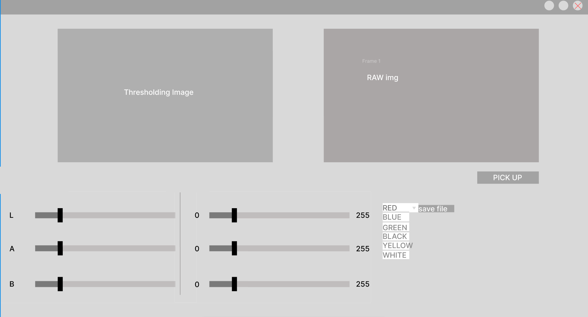
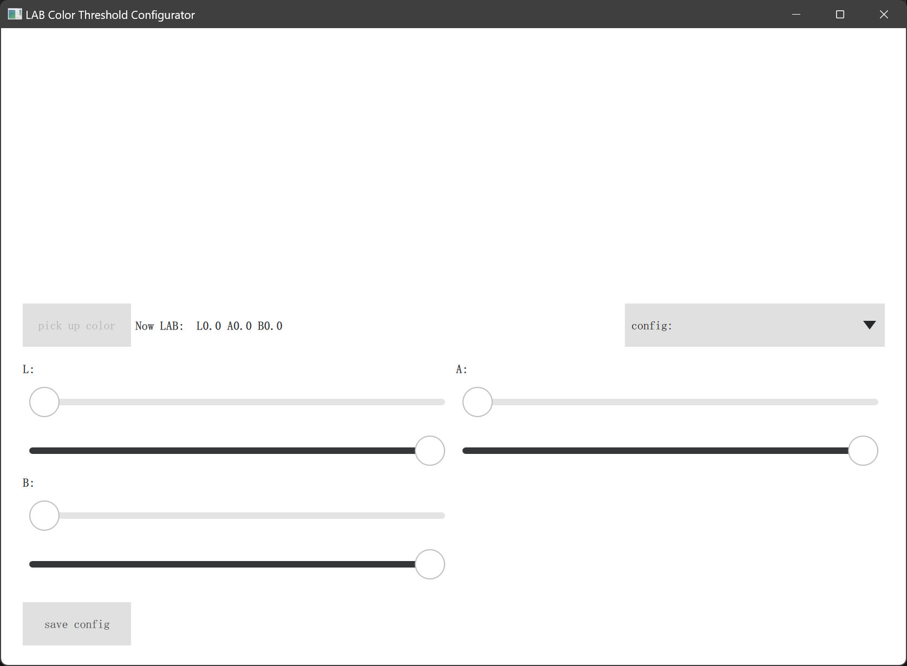

# LAB Color Threshold Configurator

## 项目简介
基于Qt框架开发的LAB颜色阈值配置工具，集成OpenCV图像处理算法，提供实时摄像头画面采集、二值化处理及颜色阈值调节功能。

## 功能特性
- 🎥 多摄像头设备检测与切换
- 🖼️ 实时原始画面/二值化画面双窗口显示
- 🎚️ LAB颜色空间阈值滑动条调节
- ⚙️ 配置参数持久化存储
- 📷 屏幕截图及处理结果导出

## 技术栈
- **核心框架**: Qt 5.12 (QML + C++)
- **图像处理**: OpenCV 4.x
- **构建系统**: CMake 3.5+
- **跨平台支持**: Windows/Linux

## 安装指南
### 依赖项
- Ubuntu22.04

```bash
sudo apt update && sudo apt upgrade -y
sudo apt install -y build-essential cmake git pkg-config libgtk-3-dev \
    libavcodec-dev libavformat-dev libswscale-dev libv4l-dev \
    libxvidcore-dev libx264-dev libjpeg-dev libpng-dev libtiff-dev \
    gfortran openexr libatlas-base-dev python3-dev python3-numpy \
    libtbb2 libtbb-dev libdc1394-22-dev libopenexr-dev \
    libgstreamer-plugins-base1.0-dev libgstreamer1.0-dev
# 下载主仓库
git clone https://github.com/opencv/opencv.git 
cd opencv
git checkout <版本号>  # 例如：4.5.1

mkdir build && cd build
cmake -D CMAKE_BUILD_TYPE=RELEASE \
      -D CMAKE_INSTALL_PREFIX=/usr/local \
      -D INSTALL_PYTHON_EXAMPLES=ON \
      -D INSTALL_C_EXAMPLES=OFF \
      -D OPENCV_ENABLE_NONFREE=ON \
      -D OPENCV_EXTRA_MODULES_PATH=../../opencv_contrib/modules \
      -D PYTHON_EXECUTABLE=$(which python3) \
      -D BUILD_EXAMPLES=ON ..

# 使用所有CPU核心加速编译（根据CPU调整线程数）
make -j$(nproc)

# 安装到系统目录
sudo make install
sudo ldconfig  # 更新动态链接库缓存
```
- Windows
```bash
需预先安装:
- Qt 5.12 MSVC2017 64位版本
- OpenCV 4.5.x Windows预编译包
```

### 编译步骤
```bash
cmake --build ./build --config Release --target ALL_BUILD -j 22 --
```

## 使用说明
1. 启动程序后自动检测可用摄像头设备
2. 选择需要使用的摄像头索引
3. 通过LAB滑动条调节颜色阈值：
   - L（亮度）：0-255
   - A（绿-红轴）：0-255
   - B（蓝-黄轴）：0-255
4. 点击"保存配置"将参数写入`config.ini`
5. 使用保存按钮保存当前处理结果

## 配置文件说明
示例配置见`resources/config_templates/config_templates.ini`
```ini
[red]
red_L="90,110"
red_A="0,20"
red_B="0,20"

[green]
green_L="90,110"
green_A="0,20"
green_B="0,20"

[blue]
blue_L="9,29"
blue_A="0,20"
blue_B="0,20"

[black]
black_L="12,32"
black_A="0,20"
black_B="0,20"

[white]
white_L="12,32"
white_A="0,20"
white_B="0,20"

```

## 界面截图




## 贡献指南
建议:使用VSCODE编辑器+CMake插件(需要用到交叉编译)
目标平台:树莓派 pi5
1. Fork本仓库
2. 创建特性分支 (`git checkout -b feature/新功能`)
3. 提交修改 (`git commit -m '添加新功能'`)
4. 推送分支 (`git push origin feature/新功能`)
5. 创建Pull Request

## 许可协议
[MIT License](LICENSE)